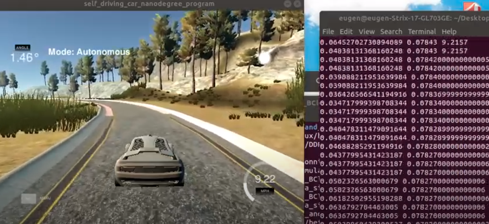

Autonomous driving car Udacity simulator - User behaviour cloning
Steps:
1)Run Udacity car simulation & record some data (images, steering angle, velocity, etc)
2)Data preparation - balance the dataset, augment data
3)Train a regression model (input images, output steering angle)
4)use the model to control the car steering angle

VIDEO:  https://youtu.be/TyJtp5w9tU8

(https://github.com/eugeniu1994/Autonomous-driving-car---behavioural-cloning/blob/main/images/img.png)

Run Simulator and Control_Car.py for testing
